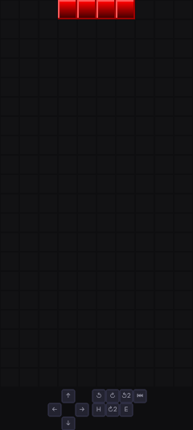
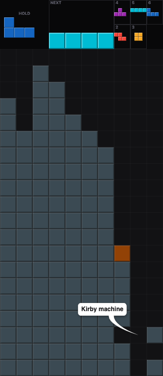

# TeDiGe-3

A browser-based diagram generator for your favorite falling four-block videogame. If you know [fumen](https://fumen.zui.jp/), it's like it (and in fact you can import diagram from it), except fancier.

TGM4 (TGM mode) is my target goal for diagramming, as such it can support most of what TGM4 can offer (namely 6 previews)

Disclosure on AI usage: this an experiment to see where Claude code can lead me. Expect some jank in the corner with all this vibe-coding.

## Features
|  |   |
| --- |  --- |
| [Player](https://petitprince.github.io/tedige-3/player.html#v1@EAFABAAiAEAmAIAeAIAmAIAiAIAiAIAiAIAeAFwIAeAMAeAMAeAMAeAMAeAMAeAMAaAQAGAEAOAUAGAEAKAgAKAgAGDkAAKF53CFCgAYFHrGDUtpcmJ5IG1hY2hpbmUAAAAAAAAAACAgg), [Editor](https://petitprince.github.io/tedige-3/#v1@EAFABAAiAEAmAIAeAIAmAIAiAIAiAIAiAIAeAFwIAeAMAeAMAeAMAeAMAeAMAeAMAaAQAGAEAOAUAGAEAKAgAKAgAGDkAAKF53CFCgAYFHrGDUtpcmJ5IG1hY2hpbmUAAAAAAAAAACAgg) | [Player](https://petitprince.github.io/tedige-3/player.html#v1@JAAARAPAAAIF3AAAAAAAAAAAAAAAAAAAPAAAIF1AAAAAAAAAAAAAAAAAAAPAAAIFzAAAAAAAAAAAAAAAAAAAPAAAIFxAAAAAAAAAAAAAAAAAAAPAAAIFvAAAAAAAAAAAAAAAAAAAPAAAIFtAAAAAAAAAAAAAAAAAAAPAAAIFrAAAAAAAAAAAAAAAAAAAPAAAIFpAAAAAAAAAAAAAAAAAAAPAAAIFnAAAAAAAAAAAAAAAAAAAPAAAIFlAAAAAAAAAAAAAAAAAAAPAAAIFkAAAAAAAAAAAAAAAAAAAPAAAIFkAAAYAAAAAAAAAAAAAAAPAAAIFkAAAoAAAAAAAAAAAAAAAPAAAIFkAABAAAAAAAAAAAAAAAAPAAAIFkAABQAAAAAAAAAAEAAgAAMAQekAAAAAKAAAAAAAAAAAgAAAB4AAAAABQAAAAAAAAAAEAAAZQ), [Editor](https://petitprince.github.io/tedige-3/#v1@JAAARAPAAAIF3AAAAAAAAAAAAAAAAAAAPAAAIF1AAAAAAAAAAAAAAAAAAAPAAAIFzAAAAAAAAAAAAAAAAAAAPAAAIFxAAAAAAAAAAAAAAAAAAAPAAAIFvAAAAAAAAAAAAAAAAAAAPAAAIFtAAAAAAAAAAAAAAAAAAAPAAAIFrAAAAAAAAAAAAAAAAAAAPAAAIFpAAAAAAAAAAAAAAAAAAAPAAAIFnAAAAAAAAAAAAAAAAAAAPAAAIFlAAAAAAAAAAAAAAAAAAAPAAAIFkAAAAAAAAAAAAAAAAAAAPAAAIFkAAAYAAAAAAAAAAAAAAAPAAAIFkAAAoAAAAAAAAAAAAAAAPAAAIFkAABAAAAAAAAAAAAAAAAPAAAIFkAABQAAAAAAAAAAEAAgAAMAQekAAAAAKAAAAAAAAAAAgAAAB4AAAAABQAAAAAAAAAAEAAAZQ) |


### Regular fumen-like board editing
- Draw, erase, and fill cells with piece colours (I, O, T, S, Z, J, L, Garbage)
- Place the active piece and control them with collision support. Supports ARS, SRS and NES
- Title and comments
- Import/export from string
- Dedicated player page

### Fancier featuress
- Input support in the diagram
- Keyboard shortcut
- Animation support
- Export to PNG, SVG, animated GIF
- Ghost piece preview, bounding box overlay, big-piece mode
- Coloured cells overlays (to highlight something)
- Textual to add comment to a specific thing
- Lock delay and gravity counter for animation
- **Computer vision module with transcription from screenshot and/or video** (including live transcription)

## Keyboard shortcuts

| Key | Action |
|-----|--------|
| `D` / `E` / `F` | Draw / Erase / Fill |
| `C` | Callout tool |
| `O` | Overlay tool |
| `Shift+M` | Mirror current frame |
| `←` / `→` (or `J` / `L`) | Previous / next frame |
| `Space` | Play / pause |
| `Shift+←/→/↓` | Move active piece |
| `Shift+↑` | Sonic drop (ARS) / hard drop (SRS) |
| `Ctrl+Z` / `Ctrl+Y` | Undo / redo |
| `?` | Show all shortcuts |

Shortcuts are fully remappable in Settings.
### Import & export
| Format | Import | Export |
|--------|--------|--------|
| Shareable URL | Yes | Yes |
| Fumen v115 | Yes | Yes |
| TetrisWiki markup | Yes | Yes |
| PNG | — | Yes |
| GIF (animated) | — | Yes |
| JSON | — | Yes |


---

# Dev corner

## Getting started

```
npm install
npm run dev
```

Open [http://localhost:5173](http://localhost:5173).

## Build

```
npm run build      # main editor
npm run build:embed  # embeddable player bundle
```


## Deployment

### Static hosting

The editor is a fully client-side app. After building, serve the `dist/` folder from any static host (Nginx, Apache, GitHub Pages, Netlify, Cloudflare Pages, etc.). No server-side logic is required.

```
npm run build
# upload the contents of dist/ to your host
```

The build produces two entry points:

| File | URL | Description |
|------|-----|-------------|
| `dist/index.html` | `/` | Full editor |
| `dist/player.html` | `/player.html` | Read-only animated player |

All assets are hashed and self-contained inside `dist/assets/`. Diagrams are stored entirely in the URL hash — no database or backend needed.

#### Nginx example

```nginx
server {
    listen 80;
    root /var/www/tedige/dist;
    index index.html;

    location / {
        try_files $uri $uri/ /index.html;
    }
}
```

#### GitHub Pages

```
npm run build
# push the contents of dist/ to your gh-pages branch,
# or configure Pages to deploy from the dist/ folder
```

If deploying to a sub-path (e.g. `https://example.com/tedige/`), set `base` in `vite.config.ts` before building:

```ts
export default defineConfig({
  base: '/tedige/',
  // ...
});
```

---

### Embeddable player

`npm run build:embed` produces a single self-contained file:

```
dist/tedige-player.js
```

Drop it on any page to embed an animated diagram without the full editor:

```html
<script src="tedige-player.js"></script>

<tedige-player
  data="v2@..."
  cell-size="28"
  skin="classic"
  autoplay
></tedige-player>
```

#### Attributes

| Attribute | Default | Description |
|-----------|---------|-------------|
| `data` | *(required)* | Encoded diagram string — the part after `#` in a share URL |
| `cell-size` | auto | Cell size in pixels. Omit to auto-fit within the element's width |
| `skin` | auto | `guideline` or `classic`. Defaults to `classic` for ARS diagrams, `guideline` otherwise |
| `autoplay` | false | Presence flag — starts animation immediately on load |

The element responds to attribute changes at runtime. All styles are injected by the script; no separate CSS file is needed.

---

## Tech stack

- [Svelte 4](https://svelte.dev/) + TypeScript
- [Vite 5](https://vitejs.dev/)
- Canvas 2D for board rendering
- [gifenc](https://github.com/mattdesl/gifenc) for GIF export
- [tetris-fumen](https://github.com/knewjade/tetris-fumen) for fumen import/export
